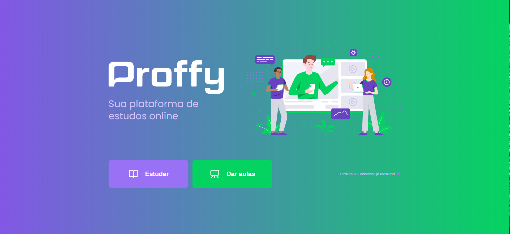
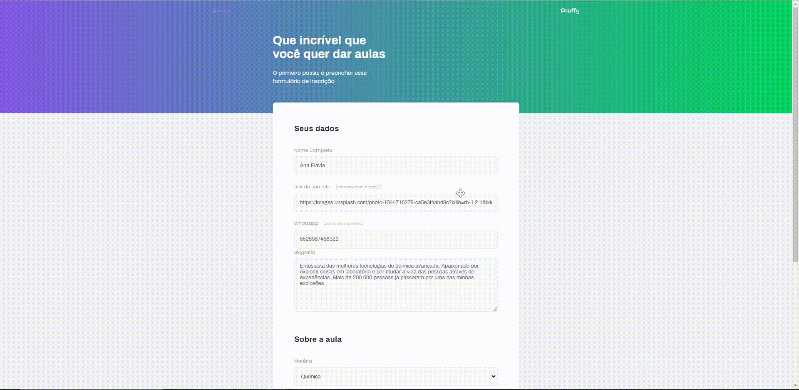
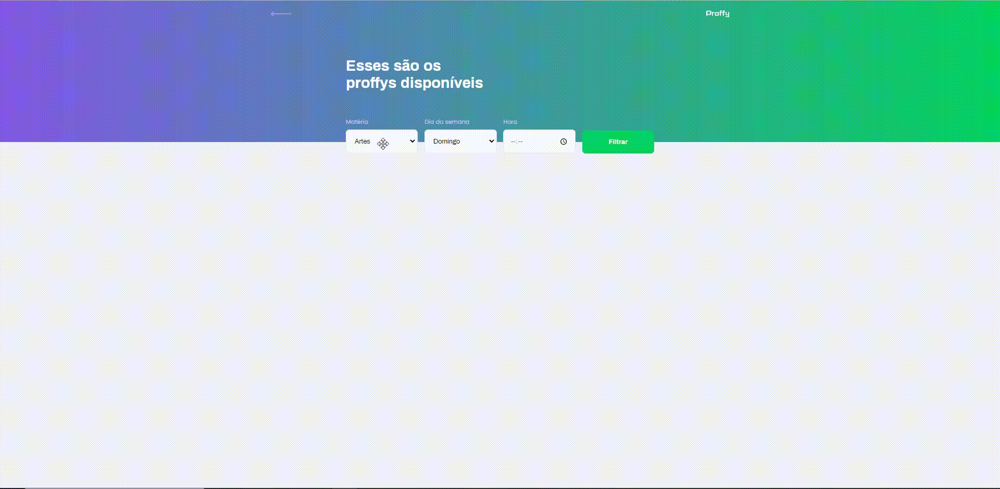

<h1>Proffy</h1>

<h2>🎨 Layout</h2>

Página de cadastro de professores

Página de listagem dos professores

<h2>🚀 Tecnologia </h2>

Esse projeto foi desenvolvido utilizando as seguintes tecnologias:

<a href="https://nodejs.org/en/">Node</a> 
<a href="https://expressjs.com/">Express</a> 
<a href="https://www.sqlite.org/index.html">SQLite</a> 
<a href="https://mozilla.github.io/nunjucks">Nunjucks</a>

<h2>💻Projeto</h2>

O Proffy é uma plataforma que permite que você possa dar aulas ou estudar.  
Projeto desenvolvido durante a NLW - Next Level Week#02 oferecida pela Rocketseat. 

